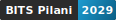
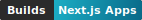
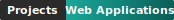
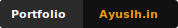

<h1 align="center">Ayush Arora</h1>

<table>
  <tr>
    <td width="64%" valign="top">
      
      <br />
      <strong>AI Engineer · Full Stack Developer · BITS Pilani CS '29</strong>
      <p>
        I build around the overlap of math, AI, and product engineering:
        computer vision experiments, generative AI apps, full-stack tools, and
        small browser projects that are fun to ship.
      </p>
      
      &nbsp;&nbsp;
      
      &nbsp;&nbsp;
      
      <br />
      
      &nbsp;&nbsp;
      
      &nbsp;&nbsp;
      
      <br />
      <a href="mailto:ayush.arora@gmail.com">
        
      </a>
      &nbsp;&nbsp;
      <a href="https://www.linkedin.com/in/ayuslh">
        
      </a>
      &nbsp;&nbsp;
      <a href="https://ayuslh.in">
        
      </a>
      &nbsp;&nbsp;
      <a href="https://leetcode.com/u/Ayuslh/">
        
      </a>
      &nbsp;&nbsp;
      
    </td>
    <td width="36%" align="center" valign="top">
      
    </td>
  </tr>
</table>

### Snapshot

<table>
  <tr>
    <td width="33%" valign="top">
      <strong>Mostly building</strong>
      <br />
      AI products, CV pipelines, and web apps with clean UX.
    </td>
    <td width="33%" valign="top">
      <strong>Best lanes</strong>
      <br />
      Fast prototypes, full-stack builds, and math-heavy problem solving.
    </td>
    <td width="33%" valign="top">
      <strong>Public signal</strong>
      <br />
      IOM Rank 1, BITS Pilani CS, GitHub projects, and LeetCode.
    </td>
  </tr>
</table>

`Computer Vision` · `Generative AI` · `Next.js` · `React` · `Node.js` · `OpenCV` · `LeetCode` · `Vanilla JS Games`

### Stack

<div align="center">
  
  <br />
  
</div>

### Selected Builds

```text
idea -> prototype -> ship -> learn
```

<table>
  <tr>
    <td width="33%" valign="top">
      <strong><a href="https://finz-theta.vercel.app/dashboard">FinZ</a></strong>
      <br />
      Finance dashboard for expenses, currency rates, and news. <a href="https://ayuslh.in/project/finz">More info</a>.
    </td>
    <td width="33%" valign="top">
      <strong><a href="https://flavor-forge-sigma.vercel.app/">Flavor Forge</a></strong>
      <br />
      Recipe discovery UI built with React, Tailwind, and public APIs. <a href="https://ayuslh.in/project/flavor-forge">More info</a>.
    </td>
    <td width="33%" valign="top">
      <strong><a href="https://artifex-nu.vercel.app/">Artifex AI Generator</a></strong>
      <br />
      Hackathon build for AI image and video workflows. <a href="https://ayuslh.in/project/ai-generator">More info</a>.
    </td>
  </tr>
  <tr>
    <td width="33%" valign="top">
      <strong><a href="https://resume.ayuslh.in">ResuMe</a></strong>
      <br />
      AI-powered resume builder and grader with ATS feedback. <a href="https://ayuslh.in/project/resume-builder">More info</a>.
    </td>
    <td width="33%" valign="top">
      <strong><a href="https://ayuslharora.github.io/Daydream_Hackathon-Debt_of_Seconds1/">Browser Games</a></strong>
      <br />
      Vanilla JS game with custom state and physics. <a href="https://ayuslh.in/project/hackathon-game">More info</a>.
    </td>
    <td width="33%" valign="top">
      <strong>Portfolio</strong>
      <br />
      Personal site at <a href="https://ayuslh.in">ayuslh.in</a>, built around fast presentation and clear SEO.
    </td>
  </tr>
</table>

### GitHub Activity

<picture>
  <source media="(prefers-color-scheme: dark)" srcset="https://raw.githubusercontent.com/ayuslharora/ayuslharora/output/pacman-contribution-graph-dark.svg">
  <source media="(prefers-color-scheme: light)" srcset="https://raw.githubusercontent.com/ayuslharora/ayuslharora/output/pacman-contribution-graph.svg">
  
</picture>

<p align="center">
  
</p>
